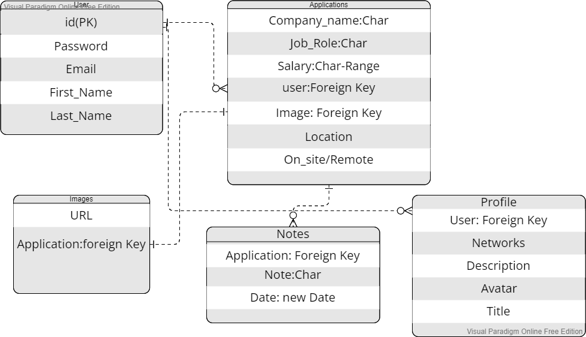
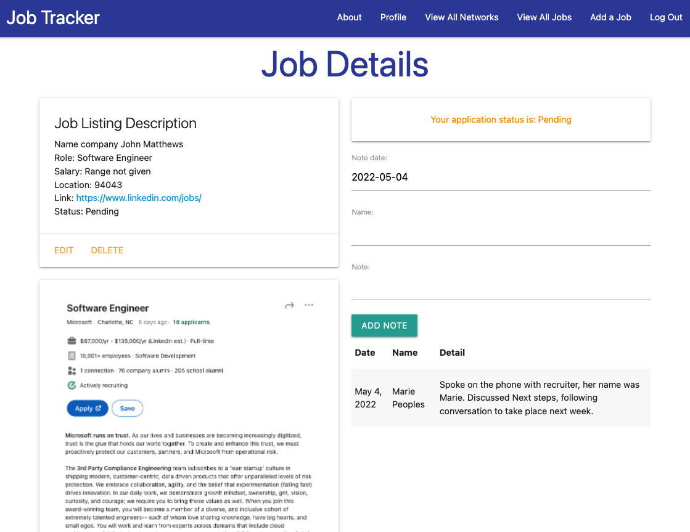
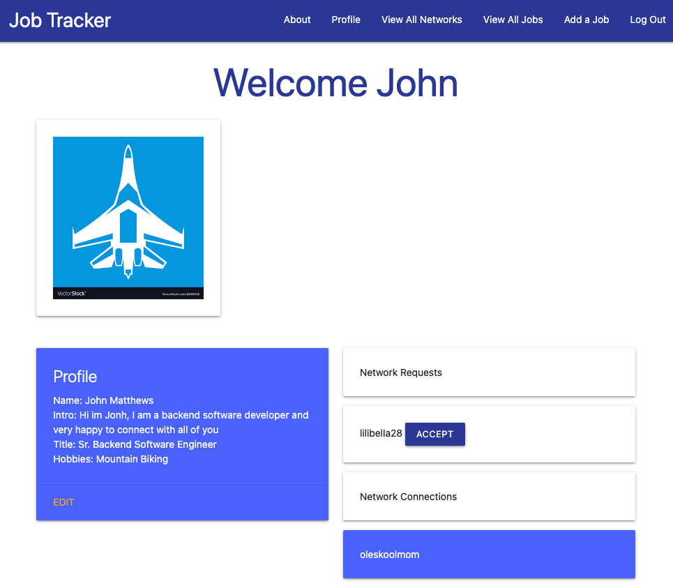
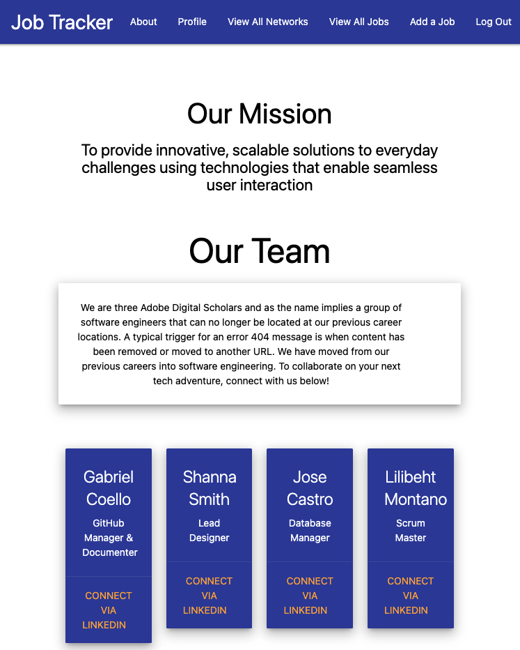

# Job Tracker Application:

### Utilize Job Tracker Today!

 

-   Job Tracker [Deployed Link](https://jobtracer.herokuapp.com/)

 

This mobile responsive application is meant as a Job Application tracking tool. Helping new grads, career transitioners, and veterans in their prospective fields keep track of their submitted applications.

This group collaboration project was a full-stack CRUD Python/Django application and is based on simplifying your job search and networking with Job Tracker users. Allowing you to input information from the job posting and tailor each application you create. You are able to include a photo of the job description, your adapted resume, notes for each step in the process, and so much more. You are also able to meet your peers using this application and connect with them. You begin by signing up and creating your profile. After that you are able to add your Job application and all your user info is protected by Django Authentication. Utilizing PostgreSQL to manage user databases and AWS S3 bucket for user uploads.

### Meet the Team

-   [Jose Castro - Database Manger](https://www.linkedin.com/in/jose-castro-fullstack-dev/)
-   [Shanna Smith - Lead Designer](https://www.linkedin.com/in/shanna-smith-full-stack-dev/)
-   [Lilibeht Montano - Scrum Master](https://www.linkedin.com/in/lilibeht-montano-29659113b/)
-   [Gabriel Coello - Github Manager & Documenter](https://www.linkedin.com/in/gabrielcoellose/)

 

## User Stories

-  AAU, I want to be able to signup, login, logout.
-  AAU, I want to be able to create profile to store my information.
-  AAU, I want to be able add an image to my profile.
-  AAU, I want to create and keep track of my job application because it will help organize the job searching process.
-  AAU, I want to be able to delete a job application if the job is not longer available.
-  AAU, I want to be able to update a job application.
-  AAU, I want to be able to mark an application as pending, rejected, or moving forward
-  AAU, I want to be able to make notes in my job applications. Because I want to keep track of any updates.
-  AAU, I want to be able to add and accept network invitation.
-  AAU, I want to be able to add an image of the job description. Because having an image of the job posting is good reference.

## ERD

## Screenshots:

 

## User Stories | ERD Diagram | Wireframes | Pitch Deck

-   [Trello Board](https://trello.com/b/T1CAsZFU/job-trackers)
-   [Pitch Deck](https://docs.google.com/presentation/d/1gGMe0__gT2qXWe9JK3oomszeMZgLg7xVvH_jHaTTAJ8/edit?usp=sharing)

 

#### Technologies used:

> Python
>
> Django
>
> PostgreSQL
>
> AWS S3
>
> DTL Templates
>
> Django Authentication
>
> Javascript
>
> Jquery
>
> CSS
>
> Materialize
>
> Figma

#### Planned Next Steps:

-   Add comment system for user interaction
-   Add User community page to share networking links, recruiters, and conferences
-   Add API for suggesting connections to users
-   Add further Mobile Responsive CSS to enhance user flow
